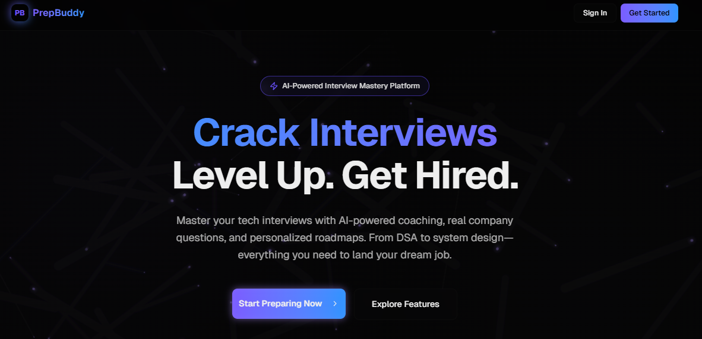
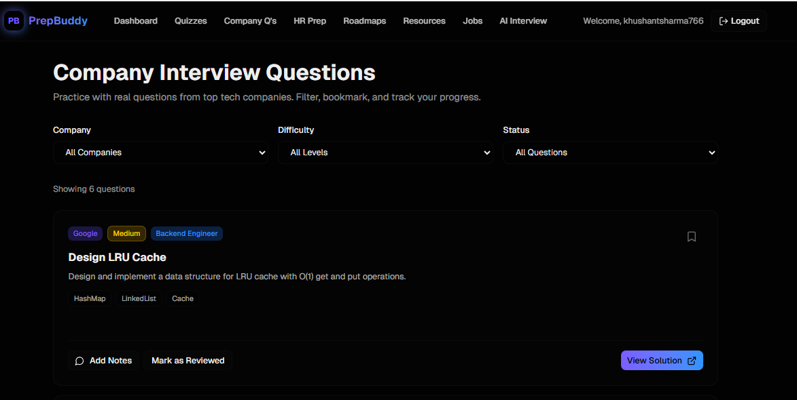
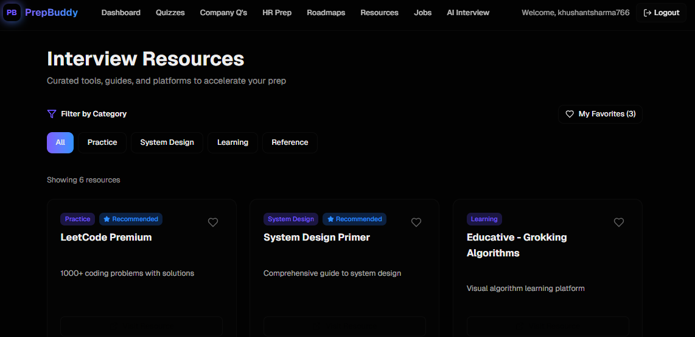
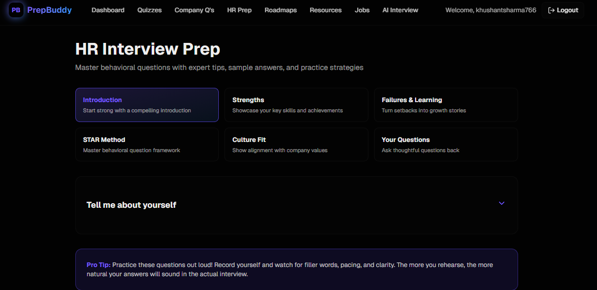

# 🚀 PrepBuddy

<p align="center">
  <b>AI-Powered Interview Preparation Platform</b><br/>
  Practice smarter. Track progress. Crack interviews 🚀
</p>

<p align="center">
  <a href="https://prepbuddy-sooty.vercel.app/"><b>🌐 Live Demo</b></a> •
  <a href="https://github.com/Khushant15/PrepBuddy"><b>📂 Repository</b></a>
</p>

<p align="center">
  
  
  
  
  
</p>

---

## ✨ About PrepBuddy

**PrepBuddy** is a modern full-stack platform designed to help developers prepare for technical and HR interviews using structured roadmaps, real-world questions, and AI-powered mock interviews.

> 💡 Built with a focus on **practical learning, consistency, and real interview simulation**

---

## 🌐 Live Demo

👉 https://prepbuddy-sooty.vercel.app/

---

## 🧠 Core Features

### 🤖 AI Interview

* Simulates real interview scenarios
* Interactive question-answer flow
* Helps improve communication & thinking

### 📊 Dashboard

* Visual progress tracking
* Learning insights and stats

### 🧩 Quizzes

* Topic-based coding quizzes
* Practice with increasing difficulty

### 🏢 Company Questions

* Questions from companies like:

  * TCS
  * Deloitte
  * Accenture
  * Wipro
* Real interview patterns

### 💬 HR Preparation

* Common HR questions
* Structured answers & tips

### 🛤️ Roadmaps

* Role-based preparation paths
* Step-by-step learning guidance

### 📚 Resources

* Curated learning materials
* Tools, articles, and references

### 💼 Jobs

* Explore job opportunities
* Stay updated with openings

---

## 🏗️ Tech Stack

| Category   | Technologies                                   |
| ---------- | ---------------------------------------------- |
| Frontend   | Next.js (App Router), TypeScript, Tailwind CSS |
| UI/UX      | Framer Motion                                  |
| Backend    | Next.js API Routes                             |
| Database   | Firebase Firestore                             |
| Auth       | Firebase Auth                                  |
| Deployment | Vercel                                         |

---

## 📂 Project Structure

```bash
prepbuddy/
├── app/                # App Router pages + APIs
├── components/         # UI components
├── lib/                # Firebase & helpers
├── hooks/              # Custom hooks
├── types/              # Type definitions
├── public/
└── README.md
```

---

## ⚙️ Local Setup

### 1️⃣ Clone Repository

```bash
git clone https://github.com/Khushant15/PrepBuddy.git
cd PrepBuddy
```

### 2️⃣ Install Dependencies

```bash
npm install
```

### 3️⃣ Setup Environment Variables

Create `.env.local`:

```env
NEXT_PUBLIC_FIREBASE_API_KEY=your_key
NEXT_PUBLIC_FIREBASE_AUTH_DOMAIN=your_domain
NEXT_PUBLIC_FIREBASE_PROJECT_ID=your_project_id
NEXT_PUBLIC_FIREBASE_STORAGE_BUCKET=your_bucket
NEXT_PUBLIC_FIREBASE_MESSAGING_SENDER_ID=your_id
NEXT_PUBLIC_FIREBASE_APP_ID=your_app_id
```

### 4️⃣ Run the App

```bash
npm run dev
```

---

## 🚀 Roadmap (Upcoming Features)

* 🔐 Secure authentication system (Google + Email)
* 📈 Advanced analytics dashboard
* 🤖 Smarter AI interview feedback
* 🧪 Code execution + evaluation engine
* 💳 Premium features & monetization

---

## 📸 Screenshots (Coming Soon)






---

## 🤝 Contributing

Contributions are welcome!

```bash
# Fork → Clone → Create Branch → Commit → Push → PR
```

---

## 👨‍💻 Author

**Khushant Sharma**

* GitHub: https://github.com/Khushant15

---

## ⭐ Support

If you found this project helpful:

👉 Give it a ⭐ on GitHub
👉 Share with friends

---

<p align="center">
  <b>Built with 💙 by Khushant Sharma</b>
</p>
